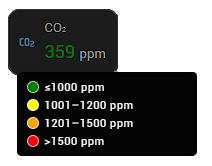
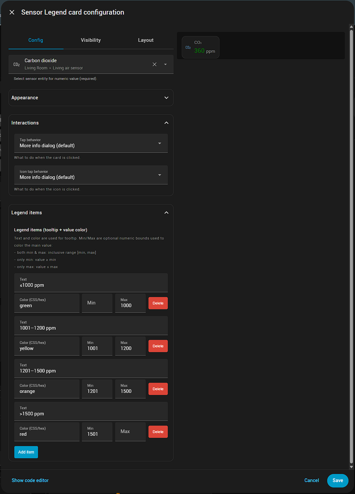

# Sensor Legend Card
 
Custom Lovelace card for Home Assistant dashboards that shows a single sensor value together with a fully configurable tooltip legend. The card is compact, mobile friendly, and now ships as a HACS-compatible repository.

## Features
- One sensor per card with auto-resolved icon and unit
- Tooltip legend with per-row color, text, and optional numeric range used to color the main reading
- Independent tap actions for the card body and the icon
- Lightweight bundle written in plain Lit + JavaScript, no build step required
- Ships with an editor for the Lovelace UI so you can configure everything without YAML if desired

## Installation

### HACS (recommended)
1. In Home Assistant open **HACS → Frontend → ⋮ → Custom repositories**.
2. Add this repo URL (`https://github.com/VahaC/HA-Sensor-legend-card`) and pick category **Dashboard**.
3. After the repository appears in HACS, press **Download**. 
4. Restart Home Assistant (or click **Reload resources**) so the new resource is picked up.
5. Add the resource automatically via HACS prompt or manually under **Settings → Dashboards → Resources** with:
	 - URL: `/hacsfiles/sensor-legend-card/sensor-legend-card.js`
	 - Resource type: `module`

### Manual
1. Download the latest `sensor-legend-card.js` from the releases page.
2. Copy it to your Home Assistant `config/www/sensor-legend-card/` folder (create the folder if missing). 
3. Add a Lovelace resource pointing to `/local/sensor-legend-card/sensor-legend-card.js` with resource type `module`.
4. Clear browser cache or reload resources from **Developer Tools → YAML → Reload resources**.

## Usage

Once the resource is available, add the card either through the visual editor (search for *Sensor Legend Card*) or via YAML:

```yaml
type: custom:sensor-legend-card
decimals: 0
entity: sensor.living_air_sensor_co2
legend_items:
  - text: ≤1000 ppm
    color: green
    max: 1000
  - text: 1001–1200 ppm
    color: yellow
    min: 1001
    max: 1200
  - text: 1201–1500 ppm
    color: orange
    min: 1201
    max: 1500
  - text: ">1500 ppm"
    color: red
    min: 1501
grid_options:
  columns: 3
  rows: 1
name: CO₂
tap_action:
  action: more-info
icon: ""
icon_tap_action:
  action: more-info
```



Legend `min`/`max` values are optional; when provided they color the numeric value whenever it falls inside the defined bounds.
Leave `icon` blank to keep the entity icon or set it to `none` to hide the icon entirely.

Prefer a more narrative walkthrough and usage ideas? The blog post has you covered: [Sensor Legend Card for Home Assistant](https://www.vahac.com/sensor-legend-card-for-home-assistant/).
